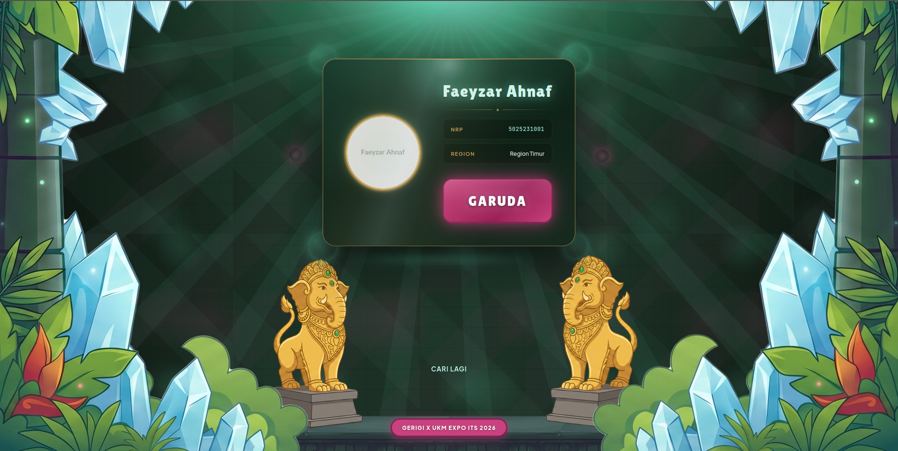
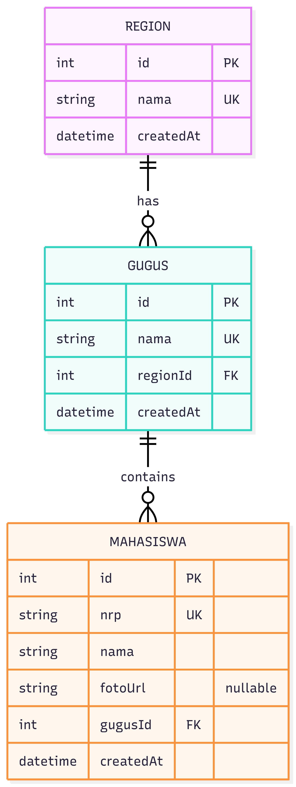

# Gugus Checker

A fullstack application to check gugus and region assignments for new students based on NRP.

## Screenshots

### Form Input


### Result Card


## Implementation Approach

### Frontend Approach
- Component-based architecture using React.js
- KartuProfilMaba component displays student info (photo, name, NRP, gugus)
- GugusCheckerForm handles NRP input and API calls
- Responsive design using Flexbox and CSS Grid 

### Backend Approach
- RESTful API with Express.js
- Single responsibility: gugus lookup service
- Prisma ORM for type-safe database operations
- Cascade delete relationships for data integrity
- Input validation and error handling with meaningful messages
- Structured API responses (success/error format)

## Technology Stack

- Backend: Node.js + Express.js + Prisma ORM + SQLite
- Frontend: React.js + Vite
- Database: SQLite (upgradeable to PostgreSQL/MySQL)

## Project Structure

```
@gugus-checker-gerex/
├── backend/
│   ├── prisma/
│   │   ├── schema.prisma          Database schema
│   │   └── seed.js                Sample data
│   ├── src/
│   │   ├── server.js              Express server
│   │   ├── routes/
│   │   │   └── gugusChecker.js    API routes
│   │   ├── controllers/
│   │   │   └── gugusCheckerController.js
│   │   └── middleware/
│   │       └── errorHandler.js
│   ├── package.json
│   ├── .env
│   └── .env.example
│
├── frontend/
│   ├── src/
│   │   ├── components/
│   │   │   ├── KartuProfilMaba.jsx
│   │   │   ├── KartuProfilMaba.css
│   │   │   ├── GugusCheckerForm.jsx
│   │   │   ├── GugusCheckerForm.css
│   │   │   ├── RevealCard.jsx
│   │   │   └── RevealCard.css
│   │   ├── design-system/
│   │   │   ├── components/
│   │   │   ├── base.css
│   │   │   ├── colors.css
│   │   │   └── typography.css
│   │   ├── services/
│   │   │   └── api.js
│   │   ├── App.jsx
│   │   ├── App.css
│   │   └── main.jsx
│   ├── assets/
│   │   ├── platform.svg
│   │   ├── patung.svg
│   │   └── tiang.svg
│   ├── index.html
│   ├── vite.config.js
│   ├── package.json
│   └── .env
│
├── docs/
│   └── erd.png                    ERD diagram
│
├── .git/
├── LICENSE
└── README.md
```

## Setup and Running

### Backend Setup

```bash
cd backend

npm install
npm run prisma:generate
npm run prisma:migrate
npm run prisma:seed
npm run dev
```

Backend runs on http://localhost:3001

### API Endpoints

**GET /api/v1/gugus-checker/:nrp**
- Input: NRP (path parameter)
- Process: Query student data + join gugus and region
- Output: Student info with gugus and region assignment
- Error Handling: Validates NRP format (exactly 10 digits), returns 404 if not found

Request:
```bash
curl http://localhost:3001/api/v1/gugus-checker/5025231001
```

Success Response (200):
```json
{
  "success": true,
  "data": {
    "nrp": "5025231001",
    "nama": "Faeyzar Ahnaf",
    "gugus": "Garuda",
    "region": "Region Timur",
    "foto": "https://..."
  }
}
```

Error Response (404):
```json
{
  "success": false,
  "message": "NRP not found. Please check and try again."
}
```

### API Flow
1. Frontend sends NRP via form input
2. GugusCheckerForm validates NRP is not empty
3. Calls gugusCheckerAPI.cek(nrp) service
4. Service makes GET request to /api/v1/gugus-checker/:nrp
5. Backend validates NRP format
6. Queries mahasiswa table by NRP
7. Joins with gugus and region tables
8. Returns student data or 404 error
9. Frontend displays KartuProfilMaba with result or error message

### Frontend Setup

```bash
cd frontend

npm install
npm run dev
```

Frontend runs on http://localhost:5173

Test with these NRPs:
- 5025231001 (Faeyzar Ahnaf - Garuda)
- 5025231002 (Siti Aisyah - Rajawali)
- 5025231003 (Ahmad Rizaldi - Elang)
- 5025231004 (Dini Nurhaliza - Phoenix)
- 5025231005 (Eka Prasetyanto - Merpati)
- 5025231006 (Farah Nabila - Halcyon)

## Database Schema

### ERD



### regions
| id | nama | createdAt |
|----|------|-----------|
| 1 | Region Timur | 2026-06-01 |
| 2 | Region Barat | 2026-06-01 |
| 3 | Region Tengah | 2026-06-01 |

Relationships:
- Primary Key: id
- Unique: nama
- One region has many gugus

### gugus
| id | nama | region_id | createdAt |
|----|------|-----------|-----------|
| 1 | Garuda | 1 | 2026-06-01 |
| 2 | Rajawali | 1 | 2026-06-01 |
| 3 | Elang | 2 | 2026-06-01 |
| 4 | Phoenix | 2 | 2026-06-01 |
| 5 | Merpati | 3 | 2026-06-01 |
| 6 | Halcyon | 3 | 2026-06-01 |

Relationships:
- Primary Key: id
- Unique: nama
- Foreign Key: region_id
- One gugus has many mahasiswa

### mahasiswa
| id | nrp | nama | fotoUrl | gugus_id | createdAt |
|----|-----|------|---------|----------|-----------|
| 1 | 5025231001 | Faeyzar Ahnaf | https://... | 1 | 2026-06-01 |
| 2 | 5025231002 | Siti Aisyah | https://... | 2 | 2026-06-01 |

Relationships:
- Primary Key: id
- Unique: nrp
- Foreign Key: gugus_id
- fotoUrl: Optional field for student photo

## Frontend Components

### KartuProfilMaba
Displays student profile with responsive styling.

```jsx
<KartuProfilMaba
  nama="Faeyzar Ahnaf"
  nrp="5025231001"
  gugus="Garuda"
  region="Region Timur"
  foto="https://..."
  loading={false}
/>
```

### GugusCheckerForm
Form to input NRP and fetch student data.

## Features Implemented

### Frontend Features
- Student lookup form with NRP input
- KartuProfilMaba component displaying student details (photo, name, NRP, gugus, region)
- Real-time error handling with user-friendly messages
- Responsive design
- Smooth animations and transitions
- Design system with consistent typography and colors

### Backend Features
- RESTful API for gugus lookup
- NRP validation (exactly 10 digits format)
- Fast indexed queries on mahasiswa.nrp
- Join queries combining mahasiswa + gugus + region data
- Comprehensive error responses (400, 404, 500)
- Database seeding with 6 sample students
- Structured request/response handling

## Troubleshooting

Backend module error:
```bash
cd backend
npm run prisma:generate
```

Frontend API 404 error:
- Ensure backend is running on port 3001
- Check VITE_API_URL in frontend/.env

Database reset:
```bash
cd backend
rm dev.db
npm run prisma:migrate
npm run prisma:seed
```
